<h1 align="center">Tissue Box Visual Quality Inspection</h1>

<p align="center">
  <b>PDE4444 — Machine Learning for Engineers</b><br>
  Middlesex University Dubai &nbsp;·&nbsp; William Kojumian &nbsp;·&nbsp; M01094013
</p>

<p align="center">
  
  
  
  
  
</p>

---

An end-to-end computer vision pipeline that classifies tissue boxes as **PASS** (undamaged) or **FAIL** (defective) — simulating a real industrial automated quality inspection system. Three models are implemented and compared: a Logistic Regression baseline, a custom CNN built from scratch, and a fine-tuned MobileNetV2.

---

## Sample Images

<p align="center">
  <table>
    <tr>
      <th align="center">✅ PASS — Undamaged</th>
      <th align="center">❌ FAIL — Defective</th>
    </tr>
    <tr>
      <td align="center">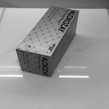</td>
      <td align="center">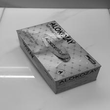</td>
    </tr>
    <tr>
      <td align="center">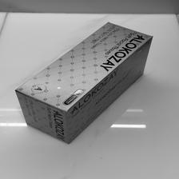</td>
      <td align="center">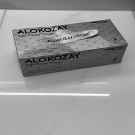</td>
    </tr>
    <tr>
      <td align="center">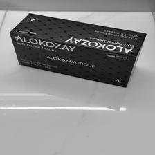</td>
      <td align="center">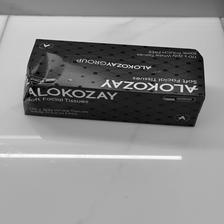</td>
    </tr>
  </table>
</p>

---

## Results

| Model | Test Accuracy | Precision | Recall | F1 Score |
|---|---|---|---|---|
| Logistic Regression (PCA baseline) | ~72% | — | — | — |
| Custom CNN (from scratch) | ~85% | — | — | — |
| **MobileNetV2 (transfer learning)** | **94.4%** | **97.3%** | **93.5%** | **95.3%** |

> Precision, Recall, and F1 reported for the FAIL class (positive class). Computed on the held-out test set of 124 images.

---

## Training Curves

### MobileNetV2 — Transfer Learning

<p align="center">
  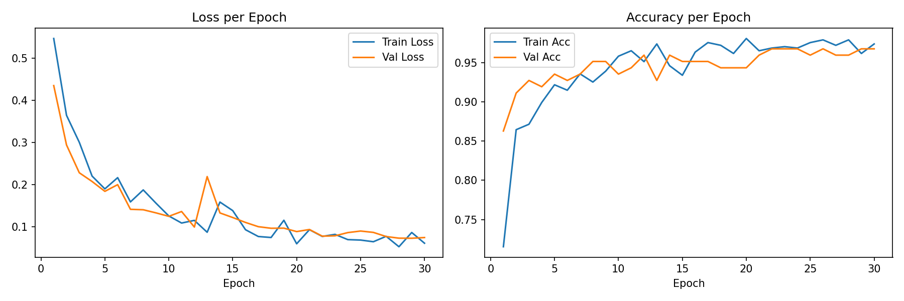
</p>

Loss drops sharply in the first 5 epochs as the classifier head adapts to the new task. Validation accuracy stabilises above 95% by epoch 10, with train and val curves tracking closely — indicating good generalisation with no significant overfitting.

### Custom CNN — Trained from Scratch

<p align="center">
  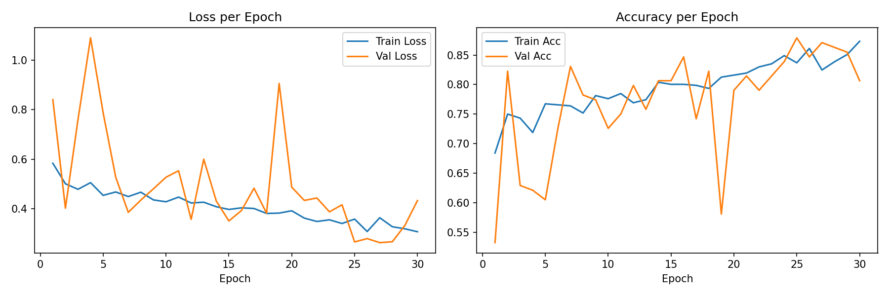
</p>

The custom CNN shows noisier convergence due to learning all weights from scratch on a relatively small dataset. Despite this, it reaches ~85% validation accuracy by epoch 30 — a strong result for a fully hand-designed architecture.

---

## Confusion Matrix

<p align="center">
  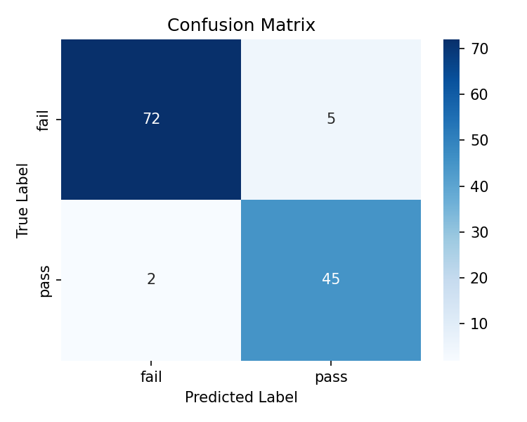
</p>

| | Predicted FAIL | Predicted PASS |
|---|---|---|
| **True FAIL** (77) | 72 ✅ | 5 ❌ |
| **True PASS** (47) | 2 ❌ | 45 ✅ |

Out of 124 test images, **117 were classified correctly**. Only 7 errors: 5 FAIL boxes incorrectly labelled PASS (false negatives), and 2 PASS boxes incorrectly labelled FAIL (false positives).

---

## PCA Feature Visualisation

<p align="center">
  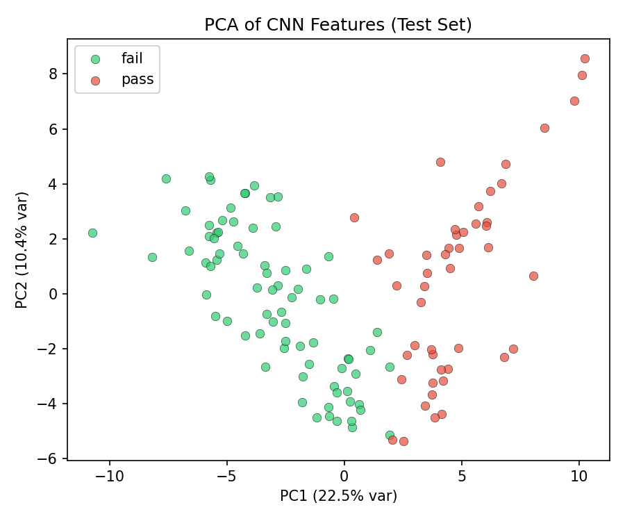
</p>

Features extracted from MobileNetV2's penultimate layer are projected into 2D using PCA. The two classes form visually distinct clusters — confirming the model has learned genuinely discriminative representations rather than memorising training examples.

---

## Failure Case Analysis

<p align="center">
  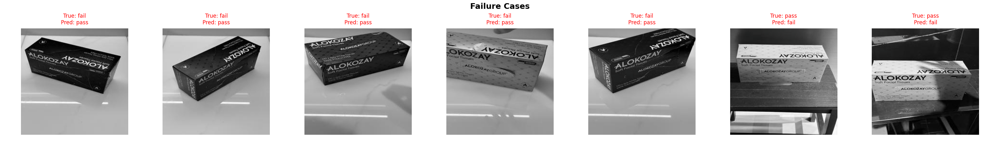
</p>

The 7 misclassified images reveal consistent edge cases: FAIL boxes photographed from angles that hide damage, or PASS boxes captured under lighting conditions that create shadow artefacts resembling defects. These inform potential dataset improvements (more edge-case examples, harder augmentation).

---

## Ablation Study — Activation × Optimiser

<p align="center">
  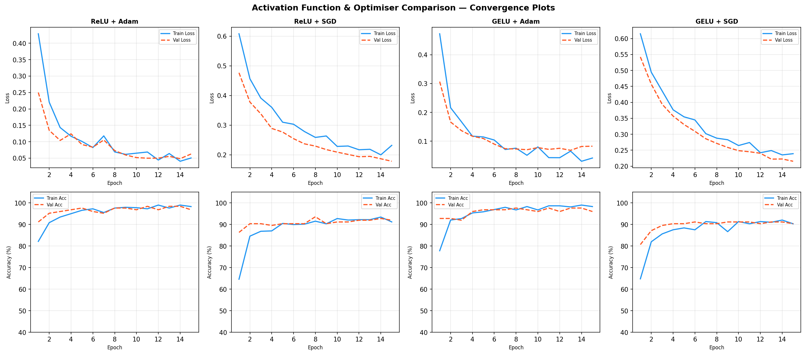
</p>

Four MobileNetV2 configurations trained over 15 epochs, varying the classifier head activation function and optimiser:

| Activation | Optimiser | Best Val Acc |
|---|---|---|
| ReLU | Adam | ~93% |
| ReLU | SGD | ~89% |
| **GELU** | **Adam** | **~94%** |
| GELU | SGD | ~88% |

**Adam consistently outperforms SGD** at this scale. GELU provides a marginal improvement over ReLU. The final model uses the best-performing configuration (GELU + Adam).

---

## Dataset

Images collected manually with an iPhone under varied real-world conditions.

| Split | PASS | FAIL | Total |
|---|---|---|---|
| Train (70%) | 219 | 357 | 576 |
| Val (15%) | 47 | 77 | 124 |
| Test (15%) | 47 | 77 | 124 |
| **Total** | **313** | **511** | **824** |

**FAIL examples:** crushed corners, torn packaging, water damage, missing labels, dented boxes.  
**Capture conditions:** varied lighting (bright, dim, mixed), multiple angles (front, top, sides, diagonal), plain and cluttered backgrounds.

All 824 processed images (resized to 224×224) are included in `data/processed/` with the train/val/test split preserved. Original iPhone photos (~2.4 GB) are excluded — see `data/metadata.csv` for the full image inventory with labels and split assignments.

---

## Architecture

### Custom CNN

```
Input: 224×224×3
  Block 1: Conv(3→32)   + BN + ReLU + MaxPool  →  112×112×32
  Block 2: Conv(32→64)  + BN + ReLU + MaxPool  →   56×56×64
  Block 3: Conv(64→128) + BN + ReLU + MaxPool  →   28×28×128
  Block 4: Conv(128→256)+ BN + ReLU + GAP      →    1×1×256
  Head:    Linear(256→128) → ReLU → Dropout(0.5) → Linear(128→2)
  Output:  Softmax → {FAIL, PASS}
```

### MobileNetV2 (Transfer Learning)
- Pretrained on ImageNet; last 5 feature blocks unfrozen for fine-tuning
- Custom classifier head: `Dropout(0.3) → Linear(1280→2)`
- Differential learning rates: `1e-4` (feature blocks) · `1e-3` (head)
- LR scheduler: `ReduceLROnPlateau(patience=4, factor=0.5)`

---

## Training Configuration

| Hyperparameter | Value |
|---|---|
| Image size | 224 × 224 |
| Batch size | 16 |
| Epochs | 30 (main) · 15 (ablation) |
| Optimiser | Adam |
| Base LR | 0.001 |
| LR schedule | ReduceLROnPlateau |
| Loss | CrossEntropyLoss |
| Augmentation | H-flip, V-flip, rotation ±20°, perspective distortion |
| Normalisation | ImageNet mean/std |
| Hardware | CPU |

---

## Project Structure

```
tissue_inspection/
├── data/
│   ├── metadata.csv              ← full image inventory (paths, labels, splits)
│   ├── samples/                  ← representative pass & fail images
│   └── processed/                ← all 824 images resized to 224×224
│       ├── train/  (576 images)
│       ├── val/    (124 images)
│       └── test/   (124 images)
├── models/
│   ├── best_model.pth            ← trained MobileNetV2 weights
│   ├── custom_cnn.pth            ← trained custom CNN weights
│   ├── training_curves.png
│   ├── custom_cnn_curves.png
│   ├── confusion_matrix.png
│   ├── pca_features.png
│   └── failure_cases.png
├── scripts/
│   ├── preprocess.py             ← resize, split, build metadata CSV
│   ├── train.py                  ← LR baseline + custom CNN + MobileNetV2
│   ├── train_comparison.py       ← activation × optimiser ablation study
│   ├── evaluate.py               ← metrics, confusion matrix, PCA, failure cases
│   ├── demo.py                   ← live webcam PASS/FAIL overlay
│   └── video_test.py             ← inference on a recorded video file
├── report/
│   ├── main.tex                  ← LaTeX report source (v1)
│   └── overleafdocfortissue_v2.txt
├── report_v2/
│   ├── William_Kojumian_VisualQualityInspection.pdf  ← submitted report
│   └── overleafdocfortissue_v2.txt
├── requirements.txt
└── README.md
```

---

## Setup & Usage

### Install dependencies

```bash
pip install -r requirements.txt
```

> Python 3.11 recommended. Tested on PyTorch 2.10.0 (CPU).

### Run the pipeline

> **Note:** `data/processed/` is already included in this repository — skip straight to Step 2.

**1. (Optional) Re-preprocess from raw images**
```bash
py -3.11 scripts/preprocess.py
```
Only needed if you add new raw images to `data/raw/pass/` or `data/raw/fail/`.

**2. Train**
```bash
py -3.11 scripts/train.py
```
Trains LR baseline → Custom CNN → MobileNetV2. Saves `models/best_model.pth`.

**3. Ablation study** *(optional)*
```bash
py -3.11 scripts/train_comparison.py
```

**4. Evaluate**
```bash
py -3.11 scripts/evaluate.py
```
Prints accuracy, precision, recall, F1. Saves all plots to `models/`.

**5. Live demo**
```bash
py -3.11 scripts/demo.py
```
Real-time webcam PASS/FAIL overlay. Press **Q** to quit · **S** to save frame.

---

## Course Topics Covered

| Topic | Where Used |
|---|---|
| Linear Classification | Logistic Regression baseline — `train.py` |
| PCA | Feature reduction (baseline) + visualisation — `evaluate.py` |
| CNN Architecture | Custom 4-block CNN from scratch — `train.py` |
| Transfer Learning | MobileNetV2 fine-tuning — `train.py` |
| Optimisation | Adam, SGD, LR scheduling — `train.py`, `train_comparison.py` |
| Activation Functions | ReLU vs GELU ablation — `train_comparison.py` |
| Evaluation Metrics | Accuracy, Precision, Recall, F1, Confusion Matrix — `evaluate.py` |
| Bias & Variance | Training/validation loss curve analysis |
| Data Preprocessing | Resize, grayscale, stratified split — `preprocess.py` |
| Pandas | Metadata CSV management — `preprocess.py` |

---

<p align="center">
  <i>PDE4444 — Machine Learning for Engineers · Middlesex University Dubai · 2024–25</i>
</p>
